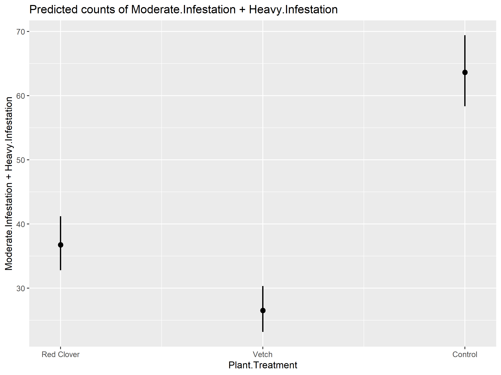
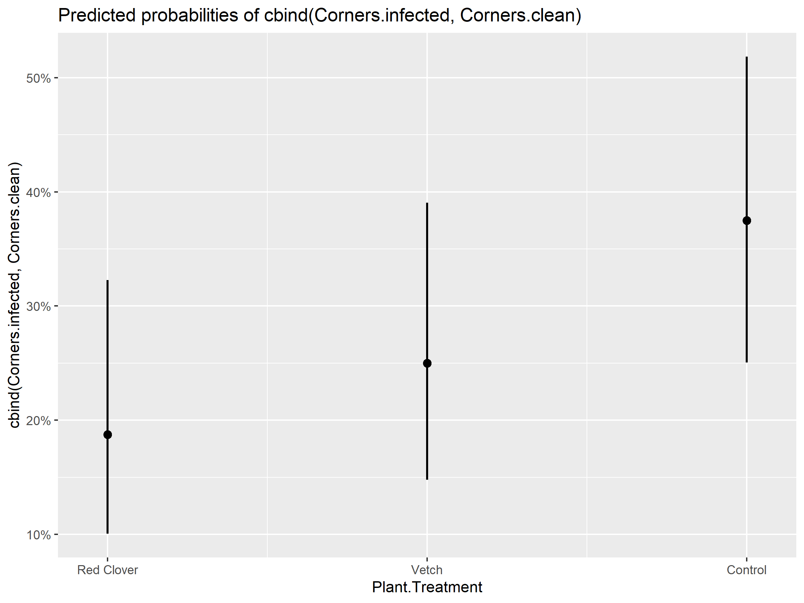
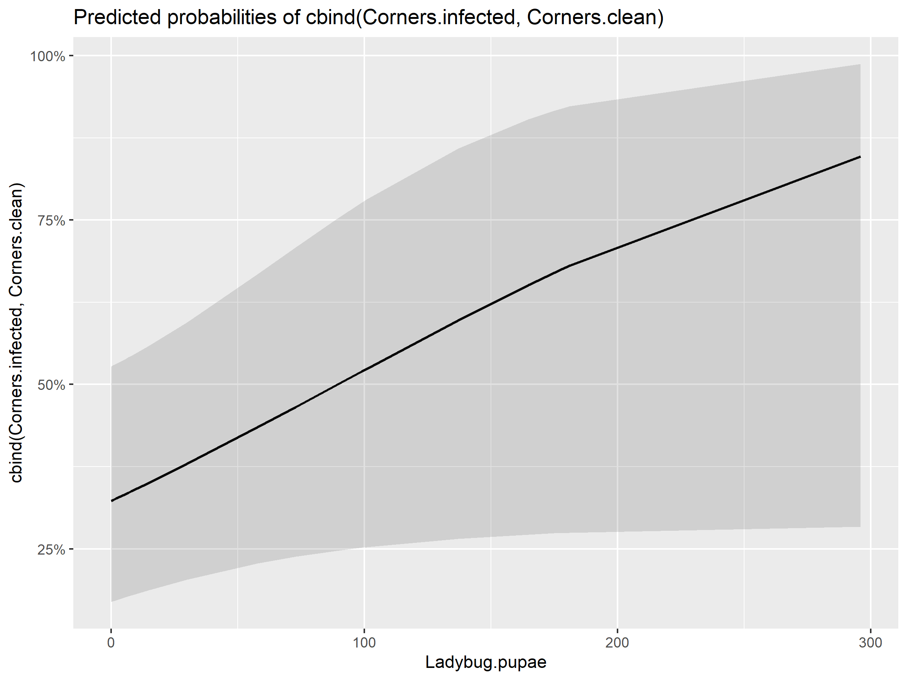
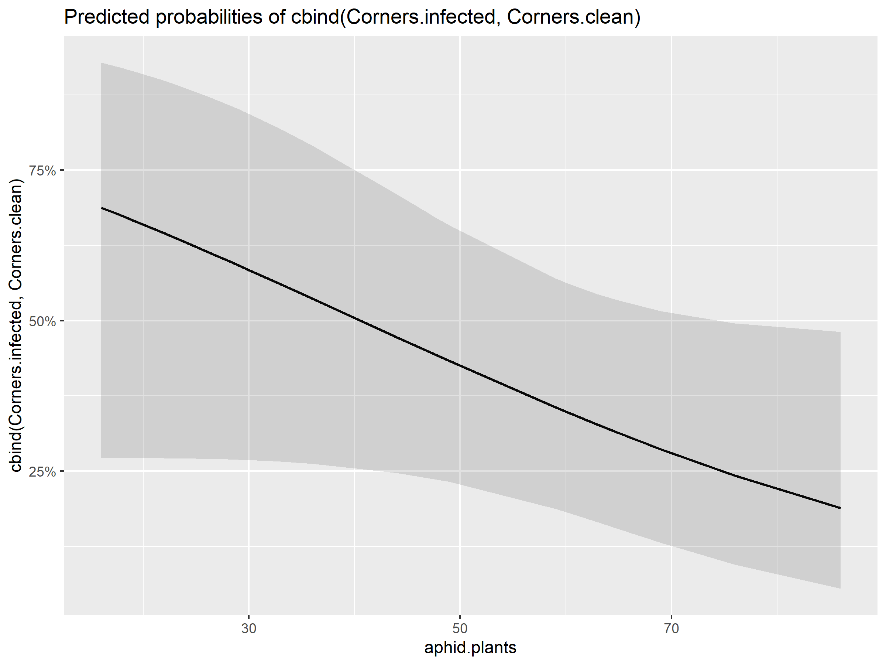
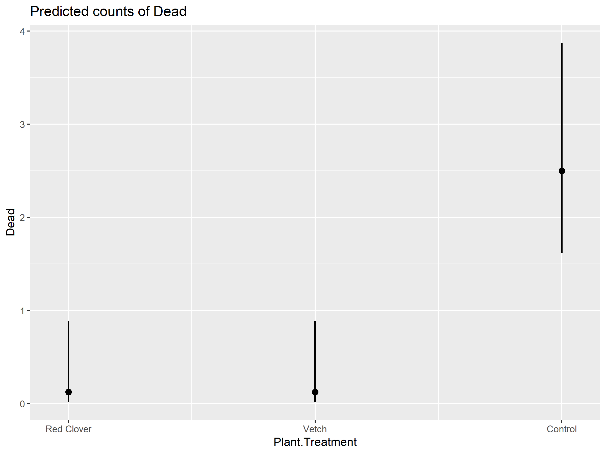
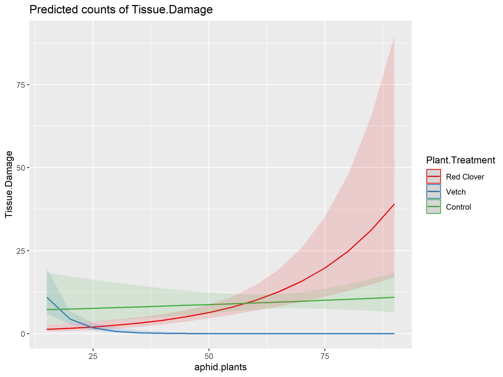
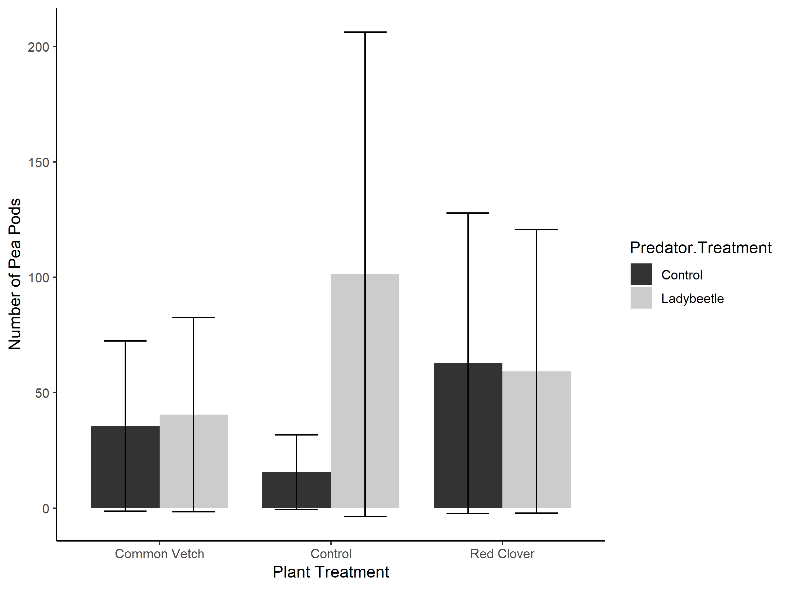
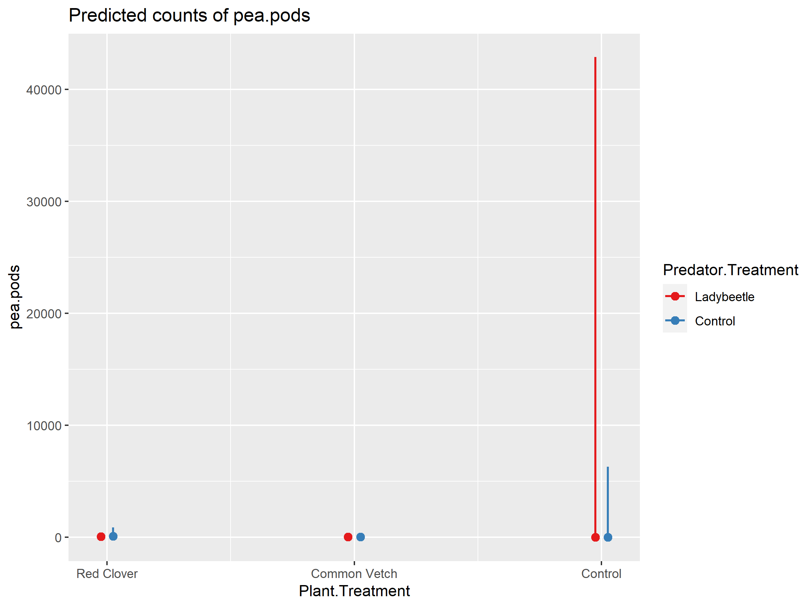
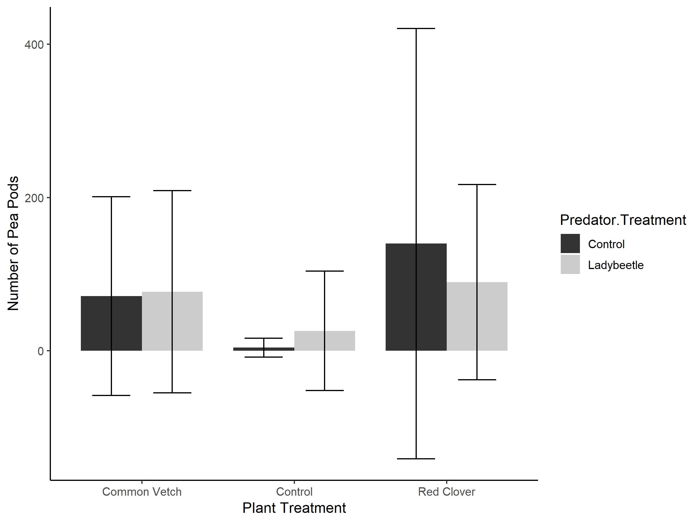
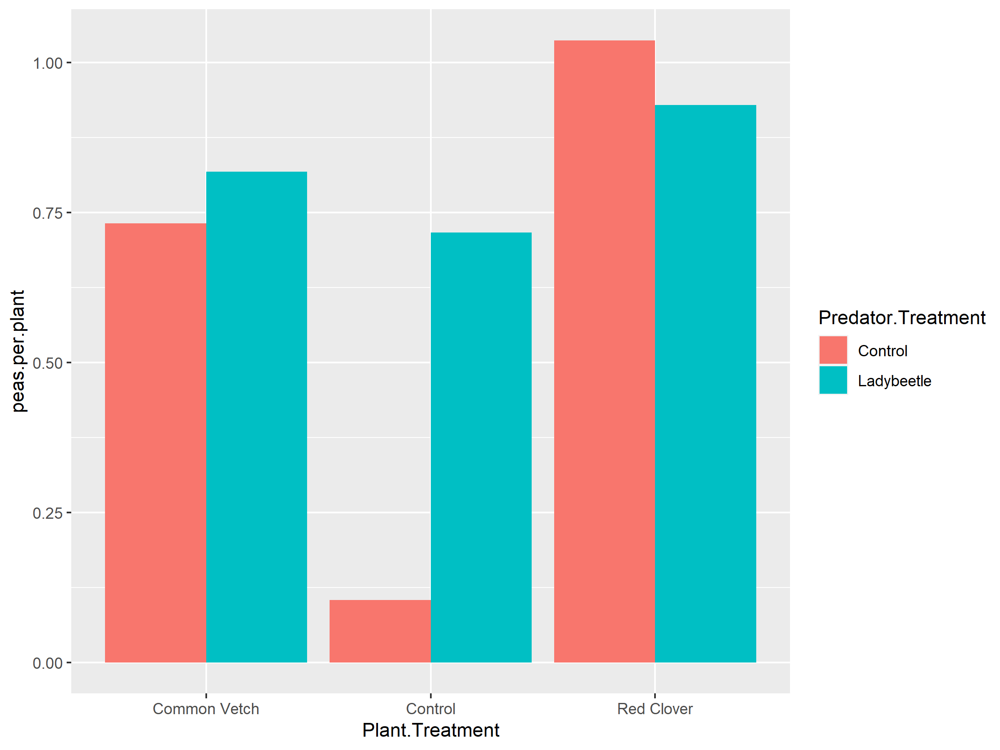

Peas Out Rob
================
Rob Clark & Riley Anderson
October 10, 2023

¶

- <a href="#overview" id="toc-overview">Overview</a>
- <a href="#experimental-design" id="toc-experimental-design">Experimental
  Design</a>
  - <a href="#summary-of-results" id="toc-summary-of-results">Summary of
    Results</a>
- <a href="#aphid-models" id="toc-aphid-models">Aphid models</a>
  - 
- <a href="#pemv-models" id="toc-pemv-models">PEMV models</a>
  - <a href="#full-pemv-model" id="toc-full-pemv-model">Full PEMV model</a>
  - <a href="#pemv-and-aphids" id="toc-pemv-and-aphids">PEMV and aphids</a>
- <a href="#dead-plants-and-plants-with-tissue-damage"
  id="toc-dead-plants-and-plants-with-tissue-damage">Dead plants and
  plants with tissue damage</a>
  - <a href="#dead-plants-by-plant-treatment"
    id="toc-dead-plants-by-plant-treatment">Dead plants by plant
    treatment</a>
  - <a href="#plants-with-tissue-damage"
    id="toc-plants-with-tissue-damage">Plants with tissue damage</a>
- <a href="#pea-pods" id="toc-pea-pods">Pea pods</a>
  - <a href="#pea-pods-by-plant-and-predator-treatment-robs-version"
    id="toc-pea-pods-by-plant-and-predator-treatment-robs-version">Pea pods
    by plant and predator treatment (Rob’s version)</a>
  - <a
    href="#pea-pods-by-plant-and-predator-treatments-adjusted-for--plants"
    id="toc-pea-pods-by-plant-and-predator-treatments-adjusted-for--plants">Pea
    pods by plant and predator treatments (adjusted for # plants)</a>
  - <a href="#total-pea-podsplant" id="toc-total-pea-podsplant">Total pea
    pods/plant</a>
- <a href="#session-information" id="toc-session-information">Session
  Information</a>

## Overview

This analysis explores Rob Clark’s “Peas Out” data.

## Experimental Design

24 bug dorms (2m x 2m x 2m) were established on an experimental farm
plot that was sown with banner pea. The dorms were laid out in a square
design with 8 control dorms in the center. Control dorms were flanked by
2 sides (4 dorms/side) where common vetch was planted in the distal half
(the outer circumference of the square) and banner pea was planted in
the proximal half (the inner circumference of the square). Diagonally
from the vetch dorms were 2 sides similarly planted with red clover.

<!-- -->

Pea aphids were introduced to all dorms. In the vetch/clover dorms,
aphids were added to the alternative host plants, in the pea-only
control dorms, aphids were added to plants on one side of the dorms.
These plants are considered the “source” plants, while the remaining pea
plants in each dorm were considered the “recipients”. Aphid spread to
recipient plants was quantified as the number of pea plants with 1) no
aphids, 2) moderate infestation, 3) heavy infestation, 4) tissue damage,
and 5) dead plants.

Ladybird beetles were added to half of all dorms (30 total, 19 adults,
10 pupae, and 1 larva). A final count of ladybird pupae in each dorm was
recorded.

PEMV presence was quantified in recipient plants from 6 samples/dorm.

The total number of pea plants/dorm was recorded as well as total number
of pea pods.

### Summary of Results

- 

## Aphid models

### 

    ##            df      AIC
    ## aphid.mod1  7 227.6237
    ## aphid.mod2 12 227.3566
    ## aphid.mod3  5 227.1021
    ## aphid.mod4  4 225.1658
    ## aphid.mod5  6 225.8483
    ## aphid.mod6  6 227.0158
    ## aphid.mod7  4 225.7930
    ## aphid.mod8  2 356.1286
    ## aphid.mod9  3 224.2389
    ## 
    ## Call:
    ## glm(formula = Moderate.Infestation + Heavy.Infestation ~ Plant.Treatment, 
    ##     family = poisson(), data = po.virus.dat)
    ## 
    ## Deviance Residuals: 
    ##     Min       1Q   Median       3Q      Max  
    ## -3.2298  -1.7050  -0.1863   1.1736   4.1991  
    ## 
    ## Coefficients:
    ##                           Estimate Std. Error z value Pr(>|z|)    
    ## (Intercept)                4.15301    0.04432  93.696  < 2e-16 ***
    ## Plant.TreatmentRed Clover -0.54887    0.07325  -7.493 6.74e-14 ***
    ## Plant.TreatmentVetch      -0.87586    0.08174 -10.715  < 2e-16 ***
    ## ---
    ## Signif. codes:  0 '***' 0.001 '**' 0.01 '*' 0.05 '.' 0.1 ' ' 1
    ## 
    ## (Dispersion parameter for poisson family taken to be 1)
    ## 
    ##     Null deviance: 221.877  on 23  degrees of freedom
    ## Residual deviance:  86.892  on 21  degrees of freedom
    ## AIC: 224.24
    ## 
    ## Number of Fisher Scoring iterations: 4
    ## $Plant.Treatment

<!-- -->

- Alternative plants are the only significant predictor of number of pea
  plants with aphids
- Both red clover and vetch dorms had \~half the number of pea plants
  with aphids
- Need to confirm that aphid counts were done only on recipient plants,
  otherwise models need to include pea plant count in the linear
  predictor.

## PEMV models

### Full PEMV model

    ##                 df      AIC
    ## plant.pemv.mod1  7 87.13939
    ## plant.pemv.mod2  3 84.00923
    ## plant.pemv.mod3  6 87.74031
    ## plant.pemv.mod4  6 87.74031
    ## plant.pemv.mod5  2 84.63670
    ## 
    ## Call:
    ## glm(formula = cbind(Corners.infected, Corners.clean) ~ Plant.Treatment, 
    ##     family = binomial(), data = po.virus.dat)
    ## 
    ## Deviance Residuals: 
    ##     Min       1Q   Median       3Q      Max  
    ## -2.3749  -1.2348  -0.2125   0.8478   2.3112  
    ## 
    ## Coefficients:
    ##                           Estimate Std. Error z value Pr(>|z|)  
    ## (Intercept)                -0.5108     0.2981  -1.713   0.0866 .
    ## Plant.TreatmentRed Clover  -0.9555     0.4750  -2.012   0.0443 *
    ## Plant.TreatmentVetch       -0.5878     0.4472  -1.314   0.1887  
    ## ---
    ## Signif. codes:  0 '***' 0.001 '**' 0.01 '*' 0.05 '.' 0.1 ' ' 1
    ## 
    ## (Dispersion parameter for binomial family taken to be 1)
    ## 
    ##     Null deviance: 44.991  on 23  degrees of freedom
    ## Residual deviance: 40.595  on 21  degrees of freedom
    ## AIC: 84.009
    ## 
    ## Number of Fisher Scoring iterations: 4
    ## $Plant.Treatment

<!-- -->

- In simpler models, plant treatment effects PEMV, with red clover dorms
  having significantly less PEMV (*P* = 0.0442677)
- However, in the full models, this effect is lost. Model selection
  justifies a *plant treatment* only model.

<!-- -->

- Ladybeetle pupae marginally increase PEMV (*P* = 0.0590435) in more
  complex models but the effect is lost on its own.

### PEMV and aphids

    ##                 df      AIC
    ## pemv.aphid.mod1 13 93.15730
    ## pemv.aphid.mod2  8 84.79192
    ## pemv.aphid.mod3  6 83.28901
    ## pemv.aphid.mod4  8 86.04783
    ## pemv.aphid.mod5  5 85.36631
    ## pemv.aphid.mod6  4 83.55282
    ## pemv.aphid.mod7  2 86.20506
    ## 
    ## Call:
    ## glm(formula = cbind(Corners.infected, Corners.clean) ~ aphid.plants + 
    ##     Plant.Treatment * Predator.Treatment + Ladybug.pupae, family = binomial(), 
    ##     data = po.virus.dat)
    ## 
    ## Deviance Residuals: 
    ##      Min        1Q    Median        3Q       Max  
    ## -2.04652  -1.07718  -0.01952   0.64980   2.17139  
    ## 
    ## Coefficients:
    ##                                                         Estimate Std. Error
    ## (Intercept)                                             1.137194   1.185914
    ## aphid.plants                                           -0.032144   0.019122
    ## Plant.TreatmentRed Clover                              -1.729231   0.889746
    ## Plant.TreatmentVetch                                   -1.189330   0.844014
    ## Predator.TreatmentLadybeetle                           -0.287896   0.854339
    ## Ladybug.pupae                                           0.007423   0.004262
    ## Plant.TreatmentRed Clover:Predator.TreatmentLadybeetle -0.609650   1.040236
    ## Plant.TreatmentVetch:Predator.TreatmentLadybeetle      -1.042381   0.955779
    ##                                                        z value Pr(>|z|)  
    ## (Intercept)                                              0.959   0.3376  
    ## aphid.plants                                            -1.681   0.0928 .
    ## Plant.TreatmentRed Clover                               -1.944   0.0520 .
    ## Plant.TreatmentVetch                                    -1.409   0.1588  
    ## Predator.TreatmentLadybeetle                            -0.337   0.7361  
    ## Ladybug.pupae                                            1.742   0.0816 .
    ## Plant.TreatmentRed Clover:Predator.TreatmentLadybeetle  -0.586   0.5578  
    ## Plant.TreatmentVetch:Predator.TreatmentLadybeetle       -1.091   0.2754  
    ## ---
    ## Signif. codes:  0 '***' 0.001 '**' 0.01 '*' 0.05 '.' 0.1 ' ' 1
    ## 
    ## (Dispersion parameter for binomial family taken to be 1)
    ## 
    ##     Null deviance: 44.991  on 23  degrees of freedom
    ## Residual deviance: 32.634  on 16  degrees of freedom
    ## AIC: 86.048
    ## 
    ## Number of Fisher Scoring iterations: 4

<!-- -->

- Essentially no effect of \# pea plants with aphids on PEMV

## Dead plants and plants with tissue damage

### Dead plants by plant treatment

    ## 
    ## Call:
    ## glm(formula = Dead ~ Plant.Treatment, family = poisson(), data = po.virus.dat)
    ## 
    ## Deviance Residuals: 
    ##     Min       1Q   Median       3Q      Max  
    ## -2.2361  -0.5000  -0.5000  -0.1692   1.8723  
    ## 
    ## Coefficients:
    ##                           Estimate Std. Error z value Pr(>|z|)    
    ## (Intercept)                 0.9163     0.2236   4.098 4.17e-05 ***
    ## Plant.TreatmentRed Clover  -2.9957     1.0247  -2.924  0.00346 ** 
    ## Plant.TreatmentVetch       -2.9957     1.0247  -2.924  0.00346 ** 
    ## ---
    ## Signif. codes:  0 '***' 0.001 '**' 0.01 '*' 0.05 '.' 0.1 ' ' 1
    ## 
    ## (Dispersion parameter for poisson family taken to be 1)
    ## 
    ##     Null deviance: 61.879  on 23  degrees of freedom
    ## Residual deviance: 29.716  on 21  degrees of freedom
    ## AIC: 55.726
    ## 
    ## Number of Fisher Scoring iterations: 6
    ## $Plant.Treatment

<!-- -->

- Both vetch and red clover dorms had significantly fewer dead pea
  plants

### Plants with tissue damage

    ## 
    ## Call:
    ## glm(formula = Tissue.Damage ~ Plant.Treatment * aphid.plants, 
    ##     family = poisson(), data = po.virus.dat)
    ## 
    ## Deviance Residuals: 
    ##     Min       1Q   Median       3Q      Max  
    ## -3.4692  -1.4164  -0.6574   0.3682   7.7605  
    ## 
    ## Coefficients:
    ##                                         Estimate Std. Error z value Pr(>|z|)
    ## (Intercept)                             1.900189   0.610716   3.111  0.00186
    ## Plant.TreatmentRed Clover              -2.309609   0.801387  -2.882  0.00395
    ## Plant.TreatmentVetch                    3.238927   1.067992   3.033  0.00242
    ## aphid.plants                            0.005483   0.009308   0.589  0.55580
    ## Plant.TreatmentRed Clover:aphid.plants  0.039808   0.013535   2.941  0.00327
    ## Plant.TreatmentVetch:aphid.plants      -0.188323   0.044138  -4.267 1.98e-05
    ##                                           
    ## (Intercept)                            ** 
    ## Plant.TreatmentRed Clover              ** 
    ## Plant.TreatmentVetch                   ** 
    ## aphid.plants                              
    ## Plant.TreatmentRed Clover:aphid.plants ** 
    ## Plant.TreatmentVetch:aphid.plants      ***
    ## ---
    ## Signif. codes:  0 '***' 0.001 '**' 0.01 '*' 0.05 '.' 0.1 ' ' 1
    ## 
    ## (Dispersion parameter for poisson family taken to be 1)
    ## 
    ##     Null deviance: 211.52  on 23  degrees of freedom
    ## Residual deviance: 128.98  on 18  degrees of freedom
    ## AIC: 205.77
    ## 
    ## Number of Fisher Scoring iterations: 6

<!-- -->

- Plants with tissue damage is effected by both plant treatment and the
  number of plants infested with aphids.

## Pea pods

### Pea pods by plant and predator treatment (Rob’s version)

    ##  Family: nbinom2  ( log )
    ## Formula:          pea.pods ~ Predator.Treatment * Plant.Treatment
    ## Data: pupae
    ## 
    ##      AIC      BIC   logLik deviance df.resid 
    ##    211.8    220.0    -98.9    197.8       17 
    ## 
    ## 
    ## Dispersion parameter for nbinom2 family (): 0.233 
    ## 
    ## Conditional model:
    ##                                                        Estimate Std. Error
    ## (Intercept)                                              3.5695     1.0384
    ## Predator.TreatmentLadybeetle                             0.1318     1.4683
    ## Plant.TreatmentControl                                  -0.8287     1.4717
    ## Plant.TreatmentRed Clover                                0.5696     1.4675
    ## Predator.TreatmentLadybeetle:Plant.TreatmentControl      1.7450     2.0777
    ## Predator.TreatmentLadybeetle:Plant.TreatmentRed Clover  -0.1891     2.0752
    ##                                                        z value Pr(>|z|)    
    ## (Intercept)                                              3.437 0.000587 ***
    ## Predator.TreatmentLadybeetle                             0.090 0.928478    
    ## Plant.TreatmentControl                                  -0.563 0.573379    
    ## Plant.TreatmentRed Clover                                0.388 0.697899    
    ## Predator.TreatmentLadybeetle:Plant.TreatmentControl      0.840 0.401003    
    ## Predator.TreatmentLadybeetle:Plant.TreatmentRed Clover  -0.091 0.927386    
    ## ---
    ## Signif. codes:  0 '***' 0.001 '**' 0.01 '*' 0.05 '.' 0.1 ' ' 1
    ##  Predator.Treatment Plant.Treatment response    SE  df asymp.LCL asymp.UCL
    ##  Control            Common Vetch        35.5  36.9 Inf      4.64       272
    ##  Ladybeetle         Common Vetch        40.5  42.0 Inf      5.30       310
    ##  Control            Control             15.5  16.2 Inf      2.01       120
    ##  Ladybeetle         Control            101.2 104.9 Inf     13.28       772
    ##  Control            Red Clover          62.7  65.1 Inf      8.22       479
    ##  Ladybeetle         Red Clover          59.3  61.5 Inf      7.76       452
    ##  .group
    ##   1    
    ##   1    
    ##   1    
    ##   1    
    ##   1    
    ##   1    
    ## 
    ## Confidence level used: 0.95 
    ## Intervals are back-transformed from the log scale 
    ## Tests are performed on the log scale 
    ## significance level used: alpha = 0.05 
    ## NOTE: If two or more means share the same grouping symbol,
    ##       then we cannot show them to be different.
    ##       But we also did not show them to be the same.

<!-- -->

### Pea pods by plant and predator treatments (adjusted for \# plants)

    ##  Family: nbinom2  ( log )
    ## Formula:          
    ## pea.pods ~ Predator.Treatment * Plant.Treatment + median.count
    ## Data: pupae
    ## 
    ##      AIC      BIC   logLik deviance df.resid 
    ##    213.6    223.0    -98.8    197.6       16 
    ## 
    ## 
    ## Dispersion parameter for nbinom2 family (): 0.236 
    ## 
    ## Conditional model:
    ##                                                        Estimate Std. Error
    ## (Intercept)                                             2.57320    2.35641
    ## Predator.TreatmentLadybeetle                            0.07480    1.46651
    ## Plant.TreatmentControl                                 -2.84457    4.50322
    ## Plant.TreatmentRed Clover                               0.67101    1.47884
    ## median.count                                            0.01987    0.04225
    ## Predator.TreatmentLadybeetle:Plant.TreatmentControl     1.75886    2.06960
    ## Predator.TreatmentLadybeetle:Plant.TreatmentRed Clover -0.52002    2.15710
    ##                                                        z value Pr(>|z|)
    ## (Intercept)                                              1.092    0.275
    ## Predator.TreatmentLadybeetle                             0.051    0.959
    ## Plant.TreatmentControl                                  -0.632    0.528
    ## Plant.TreatmentRed Clover                                0.454    0.650
    ## median.count                                             0.470    0.638
    ## Predator.TreatmentLadybeetle:Plant.TreatmentControl      0.850    0.395
    ## Predator.TreatmentLadybeetle:Plant.TreatmentRed Clover  -0.241    0.809

<!-- -->

    ##  Predator.Treatment Plant.Treatment response    SE  df asymp.LCL asymp.UCL
    ##  Control            Common Vetch       71.48 129.6 Inf    2.0454      2498
    ##  Ladybeetle         Common Vetch       77.04 132.0 Inf    2.6802      2214
    ##  Control            Control             4.16  12.3 Inf    0.0126      1366
    ##  Ladybeetle         Control            26.01  78.0 Inf    0.0730      9266
    ##  Control            Red Clover        139.84 280.6 Inf    2.7373      7144
    ##  Ladybeetle         Red Clover         89.59 127.3 Inf    5.5281      1452
    ##  .group
    ##   1    
    ##   1    
    ##   1    
    ##   1    
    ##   1    
    ##   1    
    ## 
    ## Confidence level used: 0.95 
    ## Intervals are back-transformed from the log scale 
    ## Tests are performed on the log scale 
    ## significance level used: alpha = 0.05 
    ## NOTE: If two or more means share the same grouping symbol,
    ##       then we cannot show them to be different.
    ##       But we also did not show them to be the same.

<!-- -->

### Total pea pods/plant

<!-- -->

## Session Information

    R version 4.2.3 (2023-03-15 ucrt)
    Platform: x86_64-w64-mingw32/x64 (64-bit)
    Running under: Windows 10 x64 (build 19045)

    Matrix products: default

    locale:
    [1] LC_COLLATE=English_United States.utf8 
    [2] LC_CTYPE=English_United States.utf8   
    [3] LC_MONETARY=English_United States.utf8
    [4] LC_NUMERIC=C                          
    [5] LC_TIME=English_United States.utf8    

    attached base packages:
    [1] stats     graphics  grDevices utils     datasets  methods   base     

    other attached packages:
     [1] sjPlot_2.8.13      glmmTMB_1.1.6      multcompView_0.1-9 piecewiseSEM_2.3.0
     [5] MuMIn_1.47.5       emmeans_1.8.5      lubridate_1.9.2    forcats_1.0.0     
     [9] stringr_1.5.0      dplyr_1.1.1        purrr_1.0.1        readr_2.1.4       
    [13] tidyr_1.3.0        tibble_3.2.1       ggplot2_3.4.1      tidyverse_2.0.0   
    [17] multcomp_1.4-23    TH.data_1.1-2      MASS_7.3-58.2      survival_3.5-3    
    [21] mvtnorm_1.1-3      car_3.1-2          carData_3.0-5      lme4_1.1-32       
    [25] Matrix_1.6-1      

    loaded via a namespace (and not attached):
     [1] jsonlite_1.8.4      splines_4.2.3       modelr_0.1.11      
     [4] datawizard_0.7.0    stats4_4.2.3        bayestestR_0.13.0  
     [7] yaml_2.3.7          backports_1.4.1     numDeriv_2016.8-1.1
    [10] pillar_1.9.0        lattice_0.20-45     glue_1.6.2         
    [13] digest_0.6.31       RColorBrewer_1.1-3  minqa_1.2.5        
    [16] colorspace_2.1-0    sandwich_3.0-2      htmltools_0.5.5    
    [19] pkgconfig_2.0.3     broom_1.0.4         DiagrammeR_1.0.10  
    [22] xtable_1.8-4        scales_1.2.1        tzdb_0.3.0         
    [25] timechange_0.2.0    generics_0.1.3      sjlabelled_1.2.0   
    [28] withr_2.5.0         TMB_1.9.2           cli_3.6.1          
    [31] magrittr_2.0.3      estimability_1.4.1  evaluate_0.20      
    [34] fansi_1.0.4         nlme_3.1-162        tools_4.2.3        
    [37] hms_1.1.3           lifecycle_1.0.3     munsell_0.5.0      
    [40] ggeffects_1.2.0     compiler_4.2.3      rlang_1.1.0        
    [43] grid_4.2.3          nloptr_2.0.3        rstudioapi_0.14    
    [46] htmlwidgets_1.6.2   visNetwork_2.1.2    rmarkdown_2.21     
    [49] boot_1.3-28.1       gtable_0.3.3        codetools_0.2-19   
    [52] sjstats_0.18.2      abind_1.4-5         sjmisc_2.8.9       
    [55] R6_2.5.1            zoo_1.8-12          knitr_1.42         
    [58] performance_0.10.2  fastmap_1.1.1       utf8_1.2.3         
    [61] rprojroot_2.0.3     insight_0.19.1      stringi_1.7.12     
    [64] Rcpp_1.0.10         vctrs_0.6.1         tidyselect_1.2.0   
    [67] xfun_0.38          
